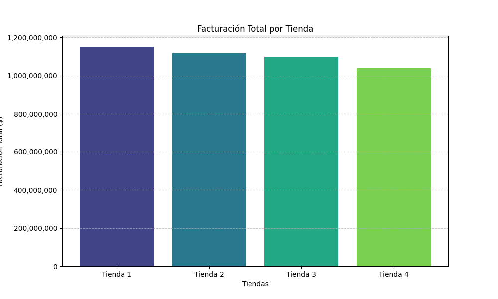
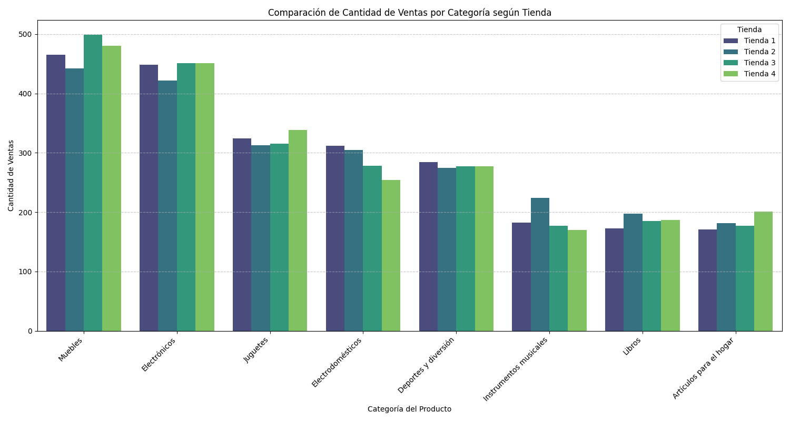
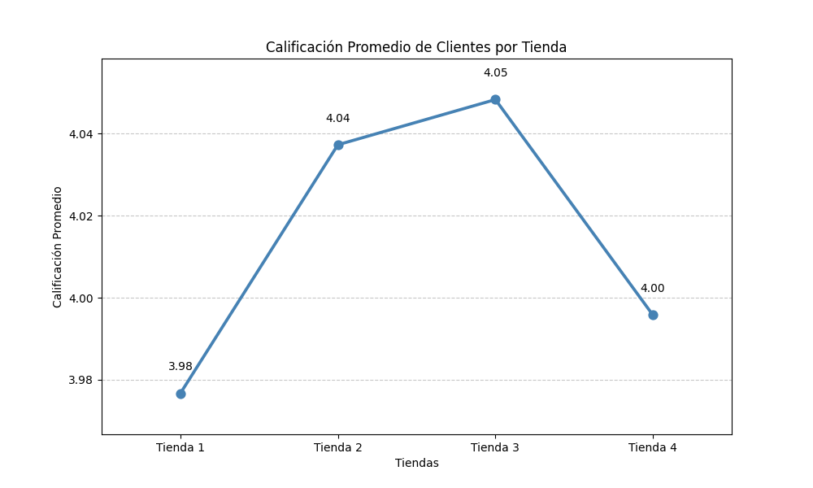
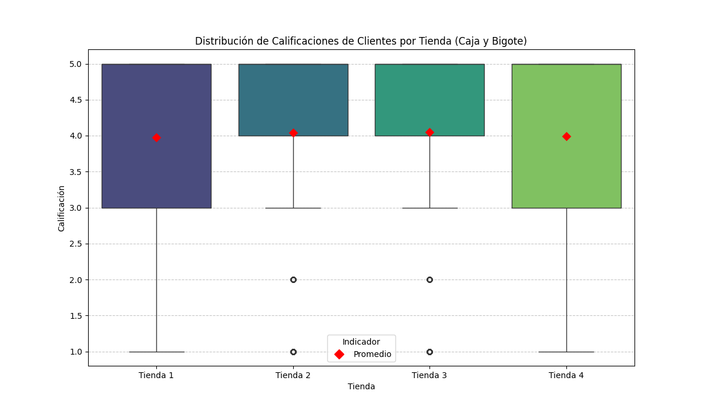

# Challenge 1 Data Science: Tiendas Juan - Análisis de Rendimiento de Tiendas

## Descripción
Este proyecto de Data Science tiene como objetivo principal asistir al Sr. Juan, propietario de la cadena 'Alura Store', en la crucial decisión de identificar y vender la tienda menos eficiente para iniciar un nuevo emprendimiento. A través de un análisis exhaustivo de datos de ventas, rendimiento de productos, satisfacción del cliente y factores geográficos de las cuatro sucursales de Alura Store, se busca proporcionar una recomendación fundamentada en datos para optimizar su estrategia de negocio.

## Estructura del Proyecto
El análisis se ha estructurado en las siguientes fases:
1.  **Extracción de Datos:** Carga de los conjuntos de datos de ventas de cada una de las cuatro tiendas.
2.  **Análisis de Datos:** Cálculo de facturación total, ventas por categoría, calificación promedio de clientes, productos más/menos vendidos y costo de envío promedio.
3.  **Visualización de Gráficos:** Creación de gráficos para representar los hallazgos de manera clara.
4.  **Informe Final:** Síntesis de los análisis y una recomendación final justificada.

## Instalación
Para ejecutar este proyecto, necesitas tener Python instalado junto con las siguientes librerías. Puedes instalarlas usando pip:

```bash
pip install pandas matplotlib seaborn folium
```

## Dependencias
-   `pandas`: Para manipulación y análisis de datos.
-   `matplotlib`: Para la creación de gráficos estáticos.
-   `seaborn`: Para visualizaciones estadísticas avanzadas y estéticas.
-   `folium`: Para la creación de mapas interactivos y heatmaps.

## Cómo Ejecutar el Proyecto
1.  **Clonar el Repositorio (si aplica):** Si este proyecto estuviera en un repositorio, el primer paso sería clonarlo.
2.  **Abrir el Notebook:** Abre el archivo `.ipynb` (por ejemplo, en Google Colab o Jupyter Notebook).
3.  **Ejecutar las Celdas:** Ejecuta las celdas del notebook secuencialmente. El notebook está diseñado para guiarte a través de cada paso del análisis, desde la carga de datos hasta la generación del informe final.
    *   **Carga de datos:** Las URLs de los CSV están provistas en el código.
    *   **Análisis:** Las celdas de análisis calculan las métricas clave para cada tienda.
    *   **Visualización:** Las celdas de visualización generarán los gráficos necesarios para el informe.
    *   **Informe Final:** Las últimas celdas contienen el informe estructurado con las conclusiones y recomendaciones.

## Hallazgos Clave y Conclusión
El análisis detallado de las cuatro tiendas de Alura Store ha revelado que, aunque todas las tiendas mantienen una satisfacción del cliente homogénea y una dependencia similar de los grandes centros urbanos (Bogotá, Medellín, Cali) para sus ventas, existen diferencias notables en su rendimiento financiero y en la eficiencia de ventas por categoría.

**La Tienda 4 consistentemente registra la facturación total más baja** y muestra una menor robustez en las ventas de categorías clave como 'Electrónicos' y 'Muebles'. Además, productos que son exitosos en otras sucursales son menos vendidos en la Tienda 4, lo que sugiere ineficiencias en la gestión de inventario o en la adaptación a la demanda local.

### Recomendación de Venta:
Basado en estos hallazgos, **se recomienda al Sr. Juan que venda la Tienda 4.** Esta decisión le permitirá liquidar la sucursal con el menor impacto en los ingresos generales de la cadena, liberando capital para su nuevo emprendimiento. Las otras tiendas (Tienda 1, 2 y 3) pueden mantener la solidez financiera de Alura Store.

### Recomendaciones para las Tiendas Restantes (1, 2, 3):
Se sugieren estrategias para optimizar el surtido, investigar anomalías en las ventas de productos específicos, aprovechar nichos de mercado, mejorar las estrategias de marketing dirigido y evaluar la eficiencia logística basándose en las fortalezas observadas en las diferentes tiendas.

## Visualizaciones Generadas
Aquí se presentan algunas de las visualizaciones clave generadas durante el análisis:

### Facturación Total por Tienda


### Comparación de Cantidad de Ventas por Categoría según Tienda


### Calificación Promedio de Clientes por Tienda


### Distribución de Calificaciones de Clientes por Tienda (Caja y Bigote)


### Comparación de Productos Más y Menos Vendidos por Tienda


### Mapa de Calor de Ventas Geográficas
(Este mapa se visualiza interactivamente en el notebook.)
